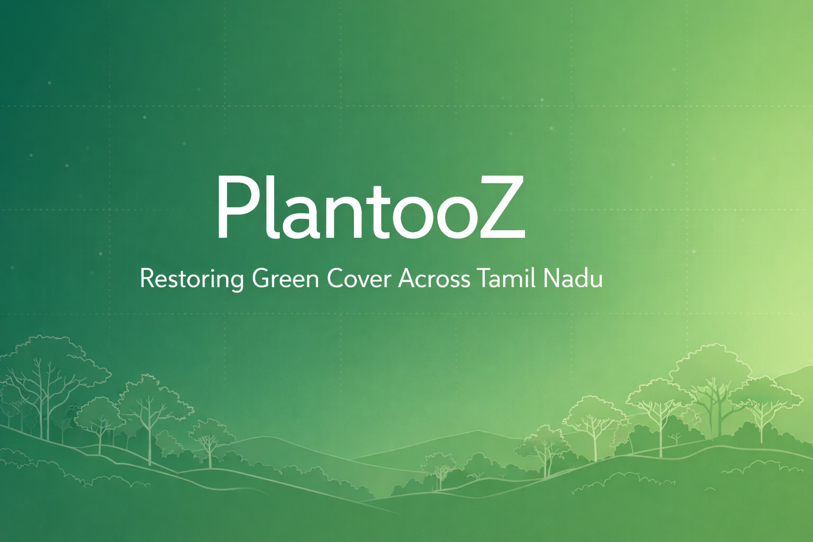

# PlantooZ
### A Community-Driven Platform to Restore Green Cover in Tamil Nadu

---

## Why PlantooZ?

Tamil Nadu is facing increasing challenges due to **deforestation, rapid urbanization, and rising pollution levels**. Shrinking green spaces not only impact air quality but also affect biodiversity, climate resilience, and overall quality of life.

**PlantooZ** was created to address this problem through technology and community participation.

> The goal of PlantooZ is to promote and verify tree planting efforts across Tamil Nadu, making environmental action visible, measurable, and collaborative.

---

## Vision & Impact

- Encourage large-scale tree planting initiatives
- Create awareness about environmental responsibility
- Enable verified, real-world contributions using maps and AI
- Build a long-term, community-driven green ecosystem

---

## Platform Overview

PlantooZ is a full-stack, mobile-first application that enables users to:
- Plant and verify trees using image analysis
- Mark and manage green territories on a map
- Track personal and community contributions
- Engage socially and stay motivated through reminders and rewards

---

## Tech Stack

| Layer | Technology |
|------|------------|
| Frontend | Expo (React Native) |
| Backend | Node.js |
| ORM | Prisma |
| Database | PostgreSQL |
| Authentication | Clerk |

<p align="left">
  
  
  
  
</p>

---

## Authentication (Clerk)

Secure user authentication powered by Clerk.

<table>
  <tr>
    <td></td>
    <td></td>
    <td></td>
  </tr>
</table>

---

## User Profile & Community

Track individual impact and social engagement.

<table>
  <tr>
    <td>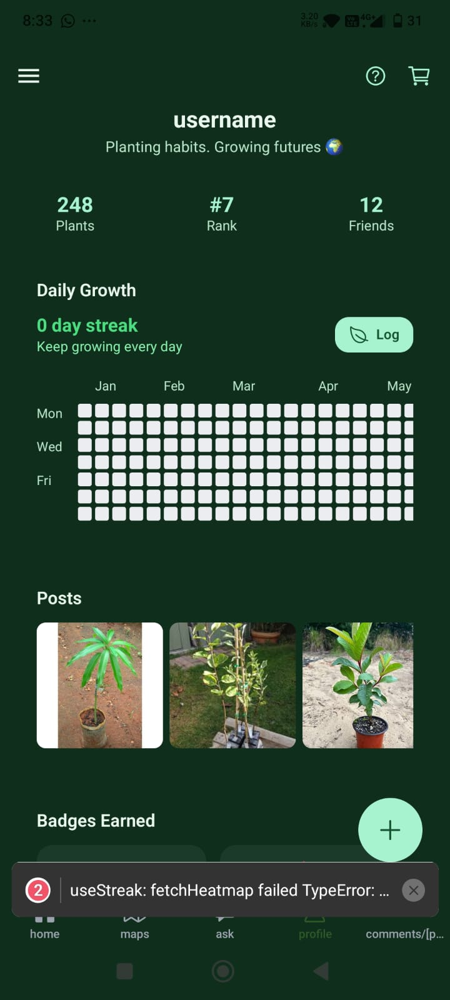</td>
    <!-- <td></td> -->
    <td>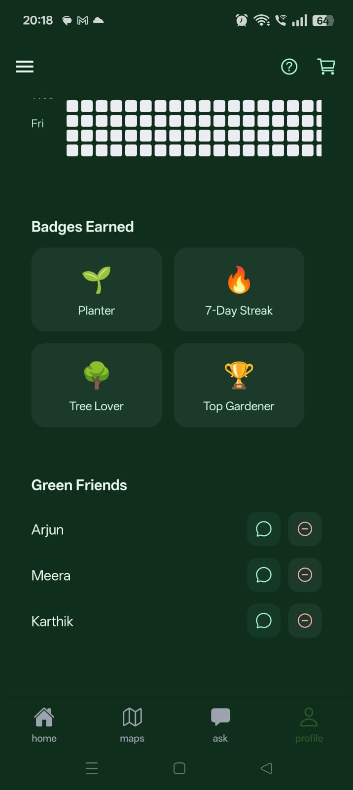</td>
  </tr>
</table>

---

## Map & Territory Management

Verified planting through maps and AI-based image analysis.

<table>
  <tr>
    <td>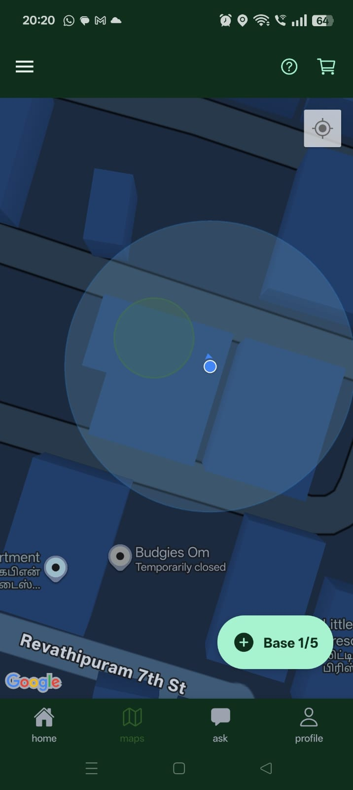</td>
    <td>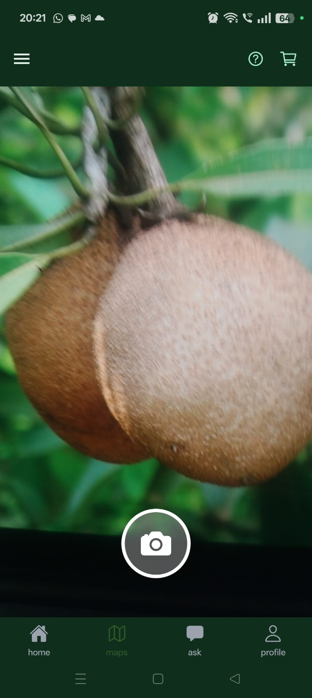</td>
    <td></td>
    <td></td>
  </tr>


<tr>
  <td>
  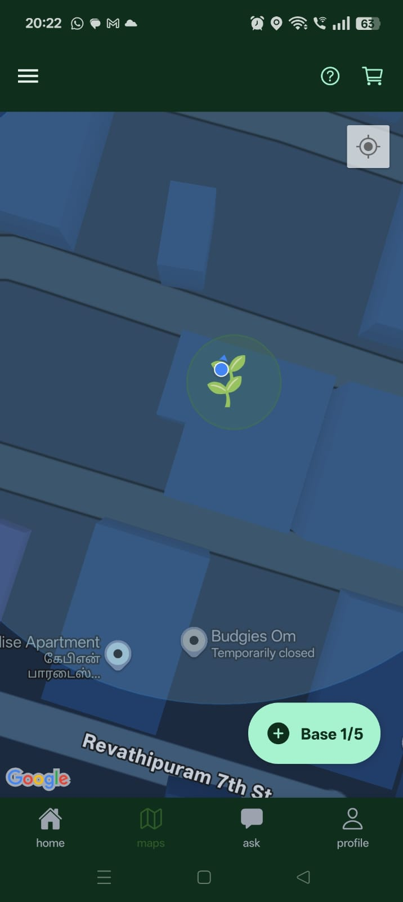</tr>
  </td>

</table>
---

## Ask (AI Assistant)

Get guidance and answers related to planting and sustainability.

<table>
  <tr>
    <td></td>
    <td>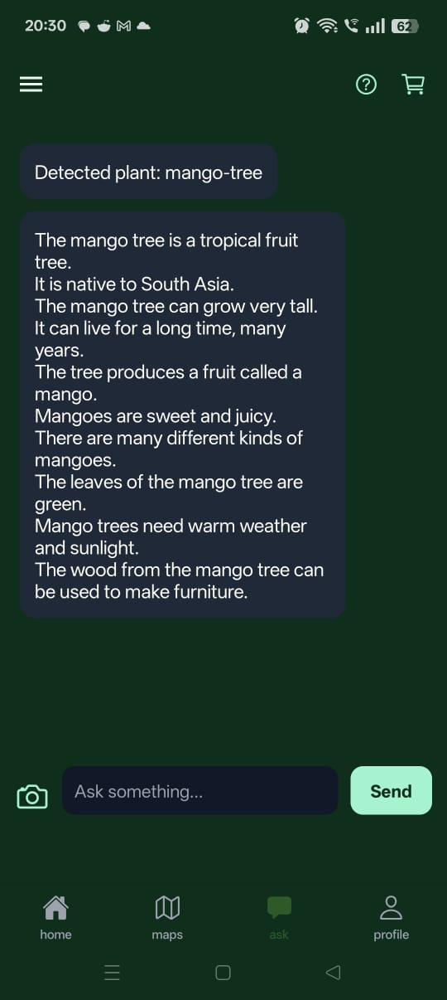</td>
  </tr>
</table>

---

## Home Feed

Community-driven feed showcasing planting activities.

<table>
  <tr>
    <td>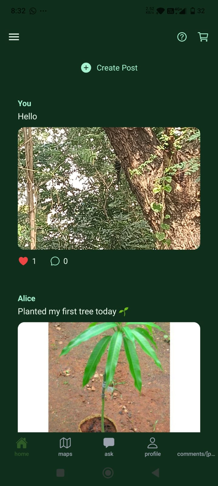</td>
    <td></td>
  </tr>
</table>

---

## Shop

Access sustainable items and rewards.

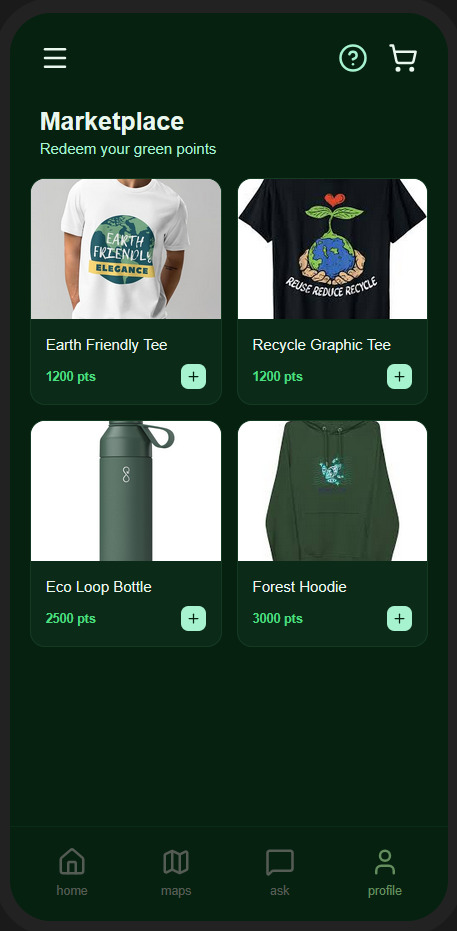

---

## Reminders & Help

Stay consistent with planting efforts and access guidance.

<table>
  <tr>
    <td>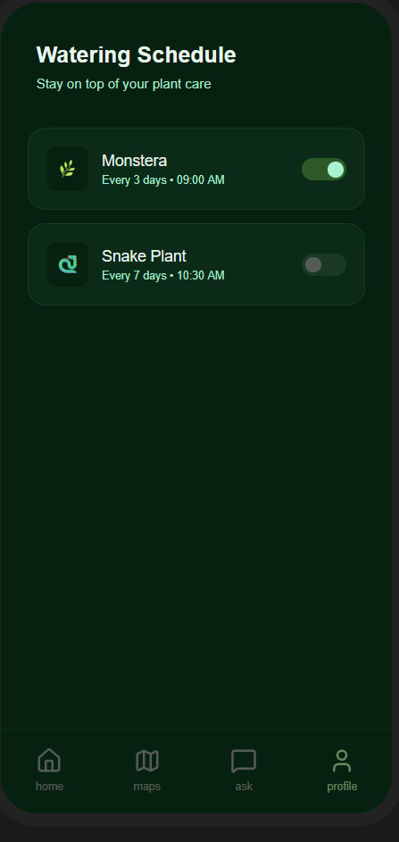</td>
    <td>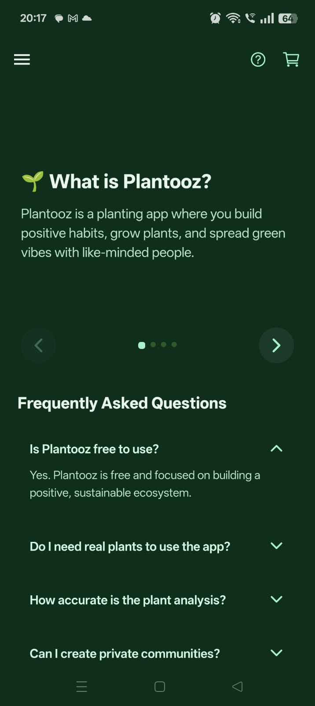</td>
  </tr>
</table>

---

## How to Run the Project

### Prerequisites
- Node.js (v16 or above)
- PostgreSQL
- Expo CLI
- npm

---

### Backend

```bash
cd backend
npm install
npm start
````

---

### Frontend (Expo)

```bash
cd frontend
npm install
expo start
```

Run on an emulator or scan the QR code using Expo Go.


---

### Team

- Sathya Narayanan
- Pranav B
- Srujan Iyengar
- Raghunandhan

---

> “The best time to plant a tree was 20 years ago. The second best time is now.”
> — Chinese Proverb


